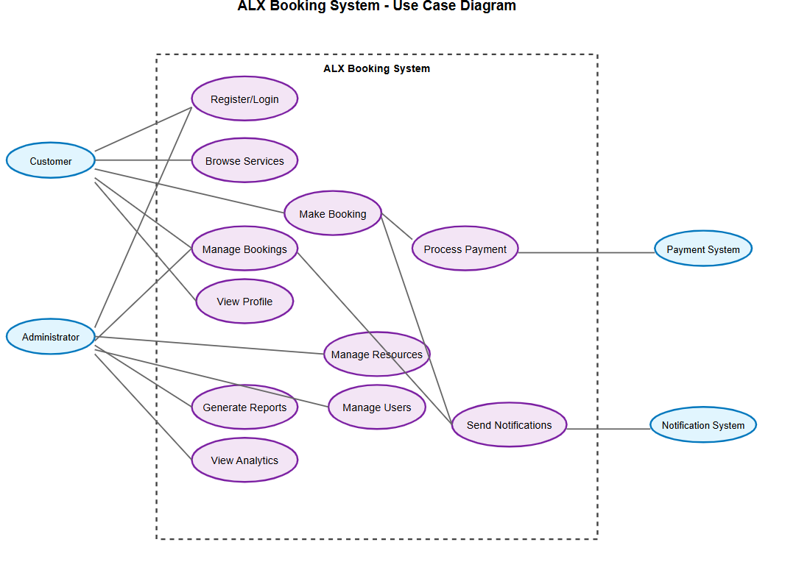

# Requirement Analysis in Software Development

This repository is dedicated to exploring the process of requirement analysis in software development. It contains resources, documentation, and examples that demonstrate how to gather, document, and manage software requirements effectively. The goal is to provide guidance and best practices for ensuring that software projects meet stakeholder needs and deliver successful outcomes.

## What is Requirement Analysis?

Requirement Analysis is a critical phase in the software development lifecycle (SDLC) where the needs and expectations of stakeholders are identified, documented, and validated. This process involves gathering information from clients, users, and other stakeholders to understand what the software must achieve and the constraints it must operate within.

During requirement analysis, requirements are categorized as functional (what the system should do) and non-functional (how the system should perform). Techniques such as interviews, surveys, document analysis, and prototyping are commonly used to elicit requirements.

The importance of requirement analysis lies in its ability to set a clear foundation for the entire development process. Well-defined requirements help prevent misunderstandings, reduce development costs, and minimize the risk of project failure. By ensuring that all stakeholders have a shared understanding of the project goals, requirement analysis enables teams to deliver software that meets user needs, complies with regulations, and achieves business objectives.

## Why is Requirement Analysis Important?

Requirement Analysis is essential in the SDLC for several key reasons:

1. **Minimizes Project Risks**  
   Thorough requirement analysis helps identify potential issues early, reducing the likelihood of costly errors, scope creep, and project delays.

2. **Ensures Stakeholder Alignment**  
   By clarifying and documenting expectations, requirement analysis ensures that all stakeholders share a common understanding of project objectives and deliverables.

3. **Improves Resource Utilization**  
   Well-defined requirements enable teams to allocate resources efficiently, prioritize tasks effectively, and avoid unnecessary rework, leading to optimized project performance.

4. **Facilitates Communication**  
   Requirement analysis provides a structured approach to documenting and communicating requirements, fostering better collaboration among project stakeholders.

5. **Enhances Quality Assurance**  
   Clear requirements serve as a basis for testing and validation, ensuring that the final product meets the specified needs and quality standards.

In summary, requirement analysis is a vital process that significantly impacts the success of software development projects. It lays the groundwork for effective planning, execution, and delivery, ultimately leading to software solutions that satisfy stakeholder expectations and deliver value to the business.

## Key Activities in Requirement Analysis

- **Requirement Gathering**  
  Collecting information from stakeholders, users, and existing systems to identify their needs, expectations, and constraints for the software project.

- **Requirement Elicitation**  
  Using techniques such as interviews, workshops, surveys, and observation to uncover and clarify requirements, ensuring a comprehensive understanding of stakeholder needs.

- **Requirement Documentation**  
  Recording requirements in a clear, structured, and accessible format, such as requirement specifications, user stories, or use cases, to facilitate communication and reference throughout the project.

- **Requirement Analysis and Modeling**  
  Examining and organizing requirements to identify relationships, dependencies, and priorities. Creating models or diagrams (e.g., flowcharts, data models) to visualize and analyze requirements for better understanding.

- **Requirement Validation**  
  Reviewing and confirming requirements with stakeholders to ensure accuracy, completeness, and feasibility. This step helps verify that documented requirements align with business objectives and stakeholder expectations.

- **Requirement Management**  
  Continuously monitoring, tracking, and managing changes to requirements throughout the project lifecycle. This activity ensures that requirements remain aligned with project goals and stakeholder needs, accommodating any necessary adjustments or enhancements.

By systematically performing these key activities, software development teams can achieve a thorough and effective requirement analysis, leading to successful project outcomes and satisfied stakeholders.

## Types of Requirements

### Functional Requirements

Functional requirements specify what the system should do—its features, behaviors, and interactions. For a booking management project (such as a hotel booking app like Airbnb or OYO), examples include:

- Users can search for available hotels or properties based on location, dates, and preferences.
- Users can view detailed information about each property, including photos, amenities, and pricing.
- Users can create an account, log in, and manage their profile.
- Users can book a property, select dates, and make payments securely.
- Hosts can list new properties, update details, and manage bookings.
- The system sends booking confirmation emails and notifications to users and hosts.
- Users can cancel or modify bookings according to property policies.

### Non-functional Requirements

Non-functional requirements define how the system performs its functions, focusing on quality attributes such as performance, security, and usability. For the booking management project, examples include:

- The system should respond to search queries within 2 seconds under normal load.
- User data and payment information must be encrypted and comply with industry security standards.
- The application should be available 99.9% of the time, ensuring high reliability.
- The user interface must be intuitive and accessible on both desktop and mobile devices.
- The system should support up to 10,000 concurrent users without performance degradation.
- All actions and transactions should be logged for audit and troubleshooting purposes.
- The application must support multiple languages for a global user base.

By clearly defining and categorizing requirements into functional and non-functional types, software development teams can ensure a comprehensive understanding of what the system should achieve and how it should perform, leading to more effective planning, design, and implementation.

## Use Case Diagrams

Use Case Diagrams are visual representations used in software engineering to illustrate the interactions between users (actors) and a system. They help identify the functional requirements by showing how different actors engage with various use cases (system functionalities). Use case diagrams are valuable for clarifying system boundaries, understanding user roles, and communicating requirements among stakeholders.

**Benefits of Use Case Diagrams:**
- Provide a clear overview of system functionality and user interactions.
- Facilitate communication between technical and non-technical stakeholders.
- Help identify and organize requirements early in the development process.
- Support validation of system scope and user expectations.

Below is a use case diagram for the booking management system, illustrating key actors and use cases:

![Booking System Use Case Diagram]![Alt text]

**Actors:**
- User
- Host
- Admin

**Use Cases:**
- Search Properties
- View Property Details
- Register/Login
- Book Property
- Make Payment
- Cancel/Modify Booking
- List Property
- Manage Bookings
- Receive Notifications
- Manage Users (Admin)
- Audit Logs (Admin)

The diagram visually maps these actors to their respective use cases, providing a comprehensive view of the booking system’s core functionalities and the interactions required to achieve them.

## Acceptance Criteria

Acceptance Criteria are specific, measurable conditions that a software feature must satisfy to be considered complete and acceptable by stakeholders. They play a crucial role in Requirement Analysis by clarifying expectations, guiding development, and serving as the basis for testing and validation. Well-defined acceptance criteria help ensure that features meet business needs, reduce ambiguity, and facilitate effective communication between developers, testers, and stakeholders.

**Importance of Acceptance Criteria:**
- Define clear boundaries for feature implementation.
- Enable objective validation and testing of requirements.
- Reduce misunderstandings and rework by specifying expected outcomes.
- Support traceability and accountability throughout the development lifecycle.

**Example: Acceptance Criteria for Checkout Feature**

- The user must be able to review their booking details before proceeding to payment.
- The system should display available payment options (e.g., credit card, PayPal).
- The user must enter valid payment information and receive real-time validation feedback.
- Upon successful payment, the system generates a booking confirmation and sends a notification email to the user.
- If payment fails, the user receives an error message and can retry or choose another payment method.
- The booking status is updated to "confirmed" only after successful payment processing.
- The user should be able to download or print the booking confirmation receipt.
- The system should log all payment transactions and updates for auditing purposes.

By establishing clear and testable acceptance criteria, development teams can ensure that the implemented features align with stakeholder expectations and project requirements, leading to higher quality software and increased customer satisfaction.

## Conclusion

Requirement analysis is a fundamental aspect of software development that directly influences the success of a project. By thoroughly understanding and documenting the needs and expectations of stakeholders, development teams can create software solutions that are not only functional but also aligned with business objectives and user needs.

This repository serves as a comprehensive resource for software developers, project managers, business analysts, and other stakeholders involved in software development projects. By following the guidance and best practices outlined in this repository, teams can enhance their requirement analysis process, leading to improved project outcomes and greater stakeholder satisfaction.

Effective requirement analysis enables software development teams to navigate the complexities of project requirements, minimize risks, and deliver high-quality software solutions that provide real value to users and businesses alike.
